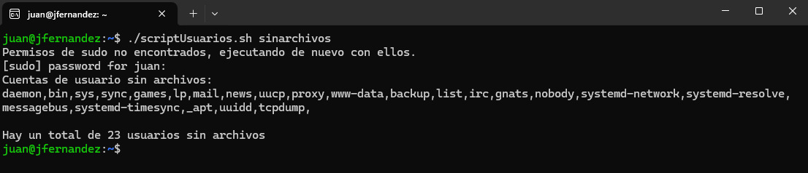

Enunciado:

Una forma de determinar la validez de una cuenta de usuario en linux es verificar si es propietaria de archivos y si es así, ver cuál fue la última fecha de modificación.
Realiza un script capaz de obtener la siguiente información sobre las cuentas:

        ◦ No tengan archivos.
        ◦ Los archivos hace 6 meses que no se modifican.
        ◦ Los archivos hace 1 año que no se modifican.
        ◦ Obtener las cuentas que cumplan el punto 1 o el 3.

- Cada apartado debe estar definido como una función (cuatro en total) dentro del script. 
- A la hora de llamar el script, se le introducirá como parámetro el nombre de la función que se desea ejecutar.
- El output por pantalla debe mostrarse separado por comas, como en el ejemplo.

(Opcional)

- El propio script detectará si no se le está pasando un parámetro válido y te devolverá la lista de parámetros válidos.
- El script necesitará permisos de sudo para ejecutarse. En caso de no dárselos en el momento de ejecutarlo, que sea el propio script el que se los otorgue.

! TIPS: 
  - Para hacer los tests, probad a crear usuarios que no tengan archivos y que sí tengan archivos.
  - Probad con el comando find y el modificador -xdev.

Ejemplo de ejecución:

